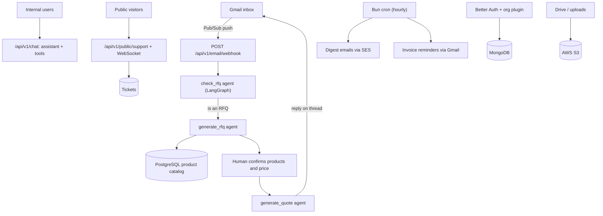

<div align="center">

### Turn inbound into revenue.

AI that replies to inquiries, generates quotes, follows up, and closes deals — automatically.


[](https://bun.sh)
[](https://typescriptlang.org)
[](https://react.dev)
[](https://langchain-ai.github.io/langgraph/)

</div>

---

## What is Inboundr?

Inboundr is a quotation-first B2B operations platform. The headline act is the quoting pipeline: an inbound RFQ hits a connected Gmail inbox, an AI agent decides whether it's actually a request for quote, pulls out the customer and the line items, matches those items against your product catalog, drafts a priced reply, and sends it back on the original email thread. No copy-pasting line items into a spreadsheet at 11pm.

Everything else in the platform exists because quoting doesn't happen in a vacuum. You also need invoices, receivables, a customer and product database, a place to talk to your team's AI, a support channel for your buyers, file storage, forms, links, and somewhere to run HR and projects. Inboundr ships all of that as one multi-tenant app.

> **Inbound, handled automatically.**

---

## The Problem

Most "AI CRMs" are a contact list with a chatbot bolted on. You still read every inbound email yourself, you still look up every part number, you still type every quote, and you still chase every unpaid invoice. The software watches you do the work and calls itself intelligent.

## The Solution

Inboundr does the typing. The RFQ pipeline turns raw inbound email into a sent quote with humans only in the loop where it matters: confirming the matched products and the price. Around it sits the operational stack you'd otherwise stitch together from six different SaaS subscriptions, all sharing one org, one auth layer, and one set of permissions.

---

## Features

### Quotation engine

The reason this thing exists.

- **Gmail RFQ ingestion** — Connected Gmail accounts push new mail in via Google Pub/Sub. No polling, no cron-scraping your inbox.
- **AI classification** — A LangGraph agent (`backend/src/agents/check_rfq.ts`) decides RFQ or not-RFQ, and tells you why when it's unsure.
- **Extraction and product matching** — `generate_rfq.ts` pulls the customer (auto-creating the CRM record) and the requested line items, then matches them against the PostgreSQL product catalog. Matches come back labelled: matched, ambiguous, or no match.
- **AI quote drafting** — `generate_quote.ts` writes the quotation email, INR pricing rules included.
- **Reply on thread** — Approve the draft and it goes out through the original Gmail thread, not some no-reply alias.
- **Attachment parsing** — PDFs, spreadsheets, and images on the inbound email are read for RFQ content (vision for images, parsing for PDF/XLSX).

### Inbox and Orders

- **Inbox (`/emails`)** — Synced Gmail view with per-message processing status (received, processing, processed, failed), RFQ classification badges, inline attachment preview (including spreadsheet rendering), and a reprocess action when the agent trips.
- **Orders (`/orders`)** — Saved quote drafts waiting on an external quote number and a "mark processed" once they're out the door.

### AI assistant chat

- **`/chat`** — A threaded internal assistant built on assistant-ui and the Vercel AI SDK. It carries real tools: search and create products and customers, and create, update, and send invoices, straight from the conversation.

### Support

- **Live web chat** — An embeddable visitor chat widget backed by a real-time WebSocket agent inbox. Typing indicators, attachments, internal notes, and canned reply templates.
- **Tickets** — Conversations land as tickets (channels: chat, email, form), link to customers, and resolve or reopen.

### Invoicing, India-first

- **GST / HSN / INR** — Built for Indian B2B, including UPI QR codes on the PDF.
- **Lifecycle** — Draft to paid to written-off, partial payments, duplication, cancellation.
- **Payment reminders** — An hourly cron nudges overdue invoices over Gmail automatically.
- **Receivables** — Aging buckets and per-customer outstanding, so you know who to chase.

### CRM and catalog

- **Customers and Products** — Full CRUD, bulk import/export (Excel/CSV), special discounts, top-seller flags, HSN/GST/pricing fields per product.

### The rest of the back office

- **Forms** — Drag-and-drop builder, public embed by slug, submission inbox, CSV export.
- **Short links** — Tracked URLs with QR codes, password protection, expiry/view caps, and geo analytics.
- **Drive** — S3-backed file storage with folders, sharing, public links, ZIP export, and AI-suggested file names.
- **Projects** — Kanban stages, tasks, subtasks, time tracking, and visibility controls.
- **Employees / HR** — Directory, teams, per-module access control, and generated HR document PDFs.
- **Attendance** — Public check-in/out embed with geolocation and selfie capture.
- **Stats** — Email, RFQ, and product analytics over 7/30/90 days.

### Platform

- **Multi-tenant orgs** with plan-based feature entitlements and per-employee module permissions.
- **Super-admin console** for managing orgs, plans, members, and invitations across the platform.
- **Org branding** — Custom logos, themes, and letterheads that flow into quote and invoice PDFs.

---

## Tech Stack

### Backend

| Technology | Role |
|---|---|
| **Bun** | Runtime and package manager |
| **Express 5** | HTTP framework |
| **LangChain / LangGraph** | RFQ classification, extraction, and quote-drafting agents |
| **Vercel AI SDK** | Streaming assistant chat and the public support bot |
| **OpenRouter** | LLM gateway (kimi-k2, gpt-oss-120b, gpt-5.x-mini, gpt-4o-mini for vision) |
| **Google Vertex AI** | Product embeddings (seed/offline tooling, not the live request path) |
| **MongoDB + Mongoose** | Primary document store and Better Auth adapter |
| **PostgreSQL** | Org-scoped product catalog |
| **Better Auth** | Authentication, with the organization plugin |
| **Gmail API** | Inbox sync, quote replies, invoice and reminder sends |
| **Google Pub/Sub** | Inbound Gmail push notifications |
| **AWS SES** | Transactional email |
| **AWS S3** | File storage for Drive, uploads, forms, attendance, and support |
| **React Email** | Email templates |
| **ws** | Real-time support chat |
| **pdfkit / pdf-parse / xlsx / qrcode** | PDF generation, attachment parsing, imports, and QR codes |

Inboundr requires Bun version v1.3.11 or higher — this is needed for Bun's built-in [cron](https://bun.com/docs/runtime/cron) support that drives the digest and payment-reminder jobs.

### Frontend

| Technology | Role |
|---|---|
| **React 19** | UI framework |
| **Vite 7** | Build tool and dev server |
| **TanStack Router** | Type-safe file-based routing |
| **assistant-ui + AI SDK** | The AI chat workspace and tool UIs |
| **shadcn/ui + Radix UI** | Component library |
| **Tailwind CSS 4** | Styling |
| **Recharts** | Stats and analytics charts |
| **PostHog** | Product analytics |
| **xlsx / qrcode / date-fns / zustand** | Imports, QR codes, dates, and state |

---

## Workspace Guide

```
inboundr/
├── backend/      # API, auth, AI agents, jobs, email, storage, data models
├── frontend/     # Authenticated dashboard, CRM, and operations workspace
├── embed/        # Public embeddable forms and short-link experiences
├── landing/      # Public marketing website
└── package.json  # Bun workspace root and shared scripts
```

This repository is a Bun workspace. Install dependencies once at the root, then run each app through the root scripts or from the individual package directories.

| Workspace | What it does | Common commands |
|---|---|---|
| `backend` | Express API behind everything: the RFQ-to-quote agents, auth and orgs, customers, products, invoices and receivables, forms, short links, Drive, projects, employees and attendance, support chat (WebSocket included), the internal AI assistant, Gmail integration, scheduled jobs, and React Email templates. It owns the data models and every external integration. | `bun run dev:backend`, `bun run typecheck:backend`, `bun run email:dev` |
| `frontend` | The authenticated Inboundr app: home, RFQ workspace, inbox, orders, AI chat, support, products, customers, invoices, receivables, stats, employees, attendance, projects, forms, links, drive, settings, search, and the super-admin console. Built with React, Vite, TanStack Router, shadcn/ui, and Tailwind. | `bun run dev:frontend`, `bun run build:frontend`, `bun run lint:frontend`, `bun run typecheck:frontend` |
| `embed` | Lightweight public-facing React app for embeddable lead-capture forms and public short-link pages. Kept separate from the dashboard so customer-facing surfaces stay small and isolated. | `bun run dev:embed`, `bun run build:embed`, `bun run lint:embed`, `bun run typecheck:embed` |
| `landing` | Marketing website with public pages such as home, features, product pages, contact, careers, legal, and security. Built with React, Vite, Tailwind, and motion. | `bun run dev:landing`, `bun run build:landing`, `bun run lint:landing`, `bun run typecheck:landing` |

### A note on file names

The frontend predates some of its routes, so a couple of names lie. `/` (the home dashboard) lives in `frontend/src/pages/home-page.tsx`, while the RFQ workspace at `/rfq` lives in `frontend/src/pages/dashboard-page.tsx`. Don't let the filename fool you.

### How the apps fit together

- `backend` is the system of record and the integration layer. Start here when changing API behavior, data models, authentication, agents, email templates, jobs, or third-party services.
- `frontend` is the internal product UI. Start here when changing authenticated workflows: quoting, CRM, invoicing, support, settings, or anything org-facing.
- `embed` is for external surfaces that leads and customers touch outside the dashboard, such as hosted forms and short-link pages.
- `landing` is for public marketing content and brand pages. Keep product app logic out of this workspace unless it's purely presentation for the public site.

## Architecture Overview

The backend is the integration boundary for product data, auth, AI workflows, email, storage, and external services. The React apps stay focused on their surfaces: public marketing, authenticated operations, and embeddable public experiences.



---

## Getting Started

### Prerequisites

- [Bun](https://bun.sh) v1.3.11 or higher installed globally

### Quick Start

```bash
# Install all workspace dependencies
bun install

# Start the API
bun run dev:backend

# Start the dashboard in another terminal
bun run dev:frontend
```

Optional local apps:

```bash
# Embeddable forms and public links
bun run dev:embed

# Marketing website
bun run dev:landing

# Email template preview
bun run email:dev
```

### Environment Variables

Create local `.env` files from the production examples, then replace placeholder values with local or development credentials.

| Workspace | Env file | Notes |
|---|---|---|
| `backend` | `backend/.env` from `backend/.env.production.example` | Requires database, auth, origin, Google OAuth/Gmail, Pub/Sub, OpenRouter, and AWS SES/S3 values. Keep production secrets only on the production host or in GitHub secrets. |
| `frontend` | `frontend/.env` from `frontend/.env.production.example` | Requires `VITE_API_URL` so the dashboard can reach the API and `VITE_EMBED_URL` for public form links. |
| `embed` | `embed/.env` from `embed/.env.production.example` | Requires `VITE_API_URL` so public forms can reach the API. |
| `landing` | Optional `landing/.env` | Add only public `VITE_*` variables for marketing-site configuration. |

Never commit real `.env` files or private keys. Use GitHub repository secrets and environment variables for CI/CD values.

### Development

```bash
# API server
bun run dev:backend

# Dashboard
bun run dev:frontend

# Embeddable forms and public links
bun run dev:embed

# Landing page
bun run dev:landing

# Email template preview
bun run email:dev
```

### Quality

```bash
# Typecheck backend and frontend
bun run typecheck

# Typecheck individual workspaces
bun run typecheck:backend
bun run typecheck:frontend
bun run typecheck:embed
bun run typecheck:landing

# Lint frontend apps
bun run lint
bun run lint:frontend
bun run lint:embed
bun run lint:landing

# Format configured frontend apps
bun run format:frontend
bun run format:landing
```

CI enforces workspace-specific checks on pull requests. Backend changes typecheck the API package; frontend app changes typecheck and build the affected Vite app before deployment.

### Build

```bash
# Default production build
bun run build

# Build individual frontend apps
bun run build:frontend
bun run build:embed
bun run build:landing
```

## Development Workflow

Use short-lived branches off `main` for feature work and fixes. Open pull requests back into `main`; the relevant GitHub Actions workflow runs based on the files changed.

Before opening a PR, run the checks for the workspace you touched:

```bash
# Backend
bun run typecheck:backend

# Dashboard
bun run typecheck:frontend
bun run lint:frontend

# Embed
bun run typecheck:embed
bun run lint:embed

# Landing
bun run typecheck:landing
bun run lint:landing
```

Merging to `main` is the production release path. The same checks run again in CI, and deployment starts only after the workflow's check or build job succeeds.

---

## Deployment

Production deployments are handled by GitHub Actions workflows in `.github/workflows`. Each app has its own workflow so changes only rebuild and deploy the workspace they affect.

| Workflow | App | Runs on | Deploy target |
|---|---|---|---|
| `backend-deploy.yml` | `backend` | Backend, deployment script, deployment docs, root package, or lockfile changes | EC2 via SSH and `systemd` |
| `frontend-deploy.yml` | `frontend` | Frontend, root package, lockfile, or frontend deployment docs changes | S3 + CloudFront |
| `embed-deploy.yml` | `embed` | Embed, root package, lockfile, or embed workflow changes | S3 + CloudFront |
| `landing-deploy.yml` | `landing` | Landing, root package, lockfile, or landing workflow changes | S3 + CloudFront |

### CI/CD Guide

- Pull requests to `main` run the relevant workspace checks before review. Backend runs `bun run typecheck:backend`; frontend apps run typecheck and production builds.
- Pushes to `main` run the same checks, then deploy only after the check/build job succeeds.
- Static apps (`frontend`, `embed`, and `landing`) build a `dist` artifact, upload hashed assets to S3 with long-lived cache headers, upload `index.html` with no-cache headers, then invalidate the matching CloudFront distribution.
- The backend workflow connects to the EC2 host over SSH, runs `scripts/deploy/ec2-deploy.sh`, installs dependencies with the frozen lockfile, restarts the `inboundr-backend` service, and checks the API health URL.
- All deployment jobs use the `production` GitHub environment and read infrastructure details from GitHub repository secrets and variables.

Common GitHub configuration:

```text
AWS_ACCESS_KEY_ID
AWS_SECRET_ACCESS_KEY
AWS_REGION
FRONTEND_S3_BUCKET
EMBED_S3_BUCKET
LANDING_S3_BUCKET
CLOUDFRONT_DISTRIBUTION_ID
EMBED_CLOUDFRONT_DISTRIBUTION_ID
LANDING_CLOUDFRONT_DISTRIBUTION_ID
VITE_API_URL
VITE_EMBED_URL
EC2_HOST
EC2_USER
EC2_SSH_KEY
API_HEALTH_URL
```

For the detailed backend EC2 runbook, see [`docs/deployment/ec2-backend.md`](docs/deployment/ec2-backend.md).

## Security Notes

- Keep real `.env` files, private keys, OAuth secrets, database URLs, and AWS credentials out of git.
- Use `BETTER_AUTH_SECRET`, trusted `FRONTEND_ORIGIN`/`API_ORIGIN` values, and environment-specific callback URLs for auth and OAuth flows.
- Store CI/CD credentials in GitHub repository secrets or protected environment variables, not in workflow files.
- Production backend secrets live on the EC2 host or in GitHub secrets; static app configuration should only expose public `VITE_*` values.
- Restrict infrastructure access where possible: EC2 SSH from trusted sources, least-privilege AWS credentials, verified SES identities, and controlled database network access.

---

## References
- Invoice Design #1 - U.S. Graphics Company Template. [Tweet](https://x.com/usgraphics/status/2054047419755864442) and [source](https://github.com/usgraphics/usgc-invoice).

## Resources
- [TanStack Start Guide for Next.js Developers](https://www.adarsha.dev/blog/tanstack-mental-model-for-nextjs-developers)

## License

Proprietary. All rights reserved.
