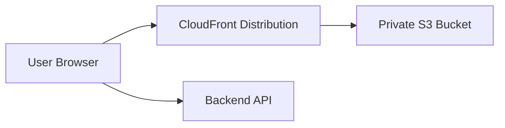

# S3 + CloudFront Frontend Deployment

This guide deploys the Vite React frontend in `frontend` to a private S3 bucket served by CloudFront.

## Architecture



Use CloudFront Origin Access Control so the S3 bucket stays private. Do not use public S3 website hosting for production.

## AWS Resources

Create these resources:

1. S3 bucket, for example `inboundr-frontend-prod`.
2. CloudFront distribution with the S3 bucket as the origin.
3. Origin Access Control attached to the S3 origin.
4. S3 bucket policy allowing only that CloudFront distribution to read objects.
5. ACM certificate in `us-east-1` if using a custom domain such as `app.example.com`.
6. DNS alias/CNAME from `app.example.com` to the CloudFront distribution.

Recommended S3 settings:

- Block all public access: enabled.
- Static website hosting: disabled.
- Versioning: optional, but useful for rollback.

Recommended CloudFront settings:

- Viewer protocol policy: redirect HTTP to HTTPS.
- Allowed methods: `GET`, `HEAD`, `OPTIONS`.
- Compress objects automatically: enabled.
- Default root object: `index.html`.
- Custom error responses for SPA routing:
  - `403` -> `/index.html` with response code `200`.
  - `404` -> `/index.html` with response code `200`.

## Frontend Environment

The frontend reads the backend API origin from `VITE_API_URL` and the public forms/embed origin from `VITE_EMBED_URL`.

For production:

```env
VITE_API_URL=https://api.example.com
VITE_EMBED_URL=https://forms.example.com
```

The example file is `frontend/.env.production.example`.

Also configure the backend CORS/auth origin:

```env
FRONTEND_ORIGIN=https://app.example.com
```

## GitHub Variables And Secrets

Add repository variables:

```text
FRONTEND_S3_BUCKET=inboundr-frontend-prod
CLOUDFRONT_DISTRIBUTION_ID=E1234567890ABC
VITE_API_URL=https://api.example.com
VITE_EMBED_URL=https://forms.example.com
```

Add repository secrets:

```text
AWS_ACCESS_KEY_ID=...
AWS_SECRET_ACCESS_KEY=...
AWS_REGION=ap-south-1
```

For a first deployment, use an IAM user with tightly scoped permissions. Later, prefer GitHub OIDC with an AWS role.

## IAM Policy

Scope the deploy identity to one S3 bucket and one CloudFront distribution:

```json
{
  "Version": "2012-10-17",
  "Statement": [
    {
      "Effect": "Allow",
      "Action": [
        "s3:ListBucket"
      ],
      "Resource": "arn:aws:s3:::inboundr-frontend-prod"
    },
    {
      "Effect": "Allow",
      "Action": [
        "s3:DeleteObject",
        "s3:GetObject",
        "s3:PutObject"
      ],
      "Resource": "arn:aws:s3:::inboundr-frontend-prod/*"
    },
    {
      "Effect": "Allow",
      "Action": "cloudfront:CreateInvalidation",
      "Resource": "arn:aws:cloudfront::YOUR_AWS_ACCOUNT_ID:distribution/E1234567890ABC"
    }
  ]
}
```

## CI/CD Behavior

The frontend workflow:

1. Runs typecheck on pull requests and pushes that touch frontend/deployment files.
2. Builds the Vite app with `VITE_API_URL` and `VITE_EMBED_URL`.
3. Uploads static assets from `frontend/dist` to S3.
4. Uses long-lived cache headers for hashed assets.
5. Uses no-cache headers for `index.html`.
6. Invalidates CloudFront so users receive the latest app shell.

## Manual Verification

After the first deploy:

```bash
curl -I https://app.example.com
curl -I https://app.example.com/assets/
```

Also verify in the browser:

- `https://app.example.com` loads.
- Refreshing nested routes works.
- API calls go to `https://api.example.com`.
- Login/session cookies work with the backend `FRONTEND_ORIGIN`.
