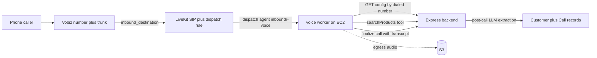

# LiveKit + Vobiz Inbound Voice Agents

## Decisions (from grilling)

- **Use case**: per-org AI receptionist — answers business/product questions, captures the caller's inquiry, logs a lead into the CRM (voice twin of the Gmail→RFQ pipeline).
- **Numbers**: platform-owned Vobiz account; platform admin buys numbers and assigns them to orgs via the existing admin panel; org→number mapping in MongoDB.
- **Worker**: new monorepo workspace package `voice/`, runs on **Node 22** (agents SDK requirement; rest of repo stays Bun), deployed as a second systemd service (`inboundr-voice`) on the existing EC2 box, talks to the backend over an internal HTTP API.
- **Pipeline**: LiveKit Inference STT→LLM→TTS (Deepgram nova-3 multilingual + Cartesia), like the starter — handles English/Hindi.
- **Per-org config**: business name, greeting, business description/knowledge, optional extra instructions; fixed prompt template.
- **Tools** *(assumed — question was skipped)*: post-call LLM lead extraction from the transcript + one in-call `searchProducts` tool against the existing Postgres hybrid search.
- **Recordings**: audio recorded via LiveKit egress to existing S3, playable in dashboard.
- **Frontend**: Calls page + Agent Settings page, gated behind a new `calls` entitlement feature key.
- **Sequencing**: Phase 1 proves telephony end-to-end with a hardcoded agent; Phase 2 builds the multi-tenant product.

## Call flow

## Phase 1 — end-to-end proof (one number, hardcoded agent)

Manual setup (documented in `voice/README.md`):

- LiveKit Cloud project → `LIVEKIT_URL`, `LIVEKIT_API_KEY`, `LIVEKIT_API_SECRET`.
- Vobiz: create credential + trunk, buy a number, PATCH trunk `inbound_destination` to the LiveKit SIP URI (without `sip:` prefix).
- LiveKit dashboard: inbound trunk with the Vobiz number, dispatch rule (individual, room prefix `call-`, agent name `inboundr-voice`).

Code:

- New workspace package `voice/` modeled on `agent-starter-node`: `@livekit/agents`, `@livekit/agents-plugin-silero`, `@livekit/agents-plugin-livekit`; move the unused `@livekit/agents` dep out of the root [package.json](../package.json). Pipeline = inference STT/LLM/TTS + Silero VAD + multilingual turn detector. Hardcoded receptionist instructions, `agentName: 'inboundr-voice'`.
- Scripts for `download-files` (VAD/turn-detector models), `dev`, `start`; Node 22 engines field.

Exit criterion: call the Vobiz number from a real phone, hold a conversation.

## Phase 2 — multi-tenant product

### Backend (`backend/src/`)

- **Models** (`models/`):
  - `phone-number.model.ts` — `{ number, organizationId, active }`.
  - `voice-agent-config.model.ts` — `{ organizationId, businessName, greeting, businessInfo, extraInstructions, enabled }`.
  - `call.model.ts` — `{ organizationId, callerNumber, dialedNumber, roomName, startedAt, endedAt, status, transcript[], summary, recordingKey, customerId, extraction }`.
- **Internal API** for the worker (`routes/` + `controllers/`, auth via shared-secret header, not session auth):
  - `GET /api/v1/internal/voice/config?number=…` — resolve dialed number → org + agent config.
  - `POST /api/v1/internal/voice/calls` / `PATCH …/calls/:id` — create at call start, finalize with transcript at end.
  - `POST /api/v1/internal/voice/product-search` — org-scoped proxy to the existing Postgres hybrid search ([backend/src/utils/product-search.ts](../backend/src/utils/product-search.ts)).
- **Post-call processing**: on finalize, LLM extraction (reuse the LangChain/OpenRouter pattern from [backend/src/agents/generate_rfq.ts](../backend/src/agents/generate_rfq.ts)) → summary + structured lead → match-or-create `Customer` by caller number.
- **Recording**: start audio-only room-composite egress to S3 at call start; store `recordingKey`; playback via presigned URL (existing uploads pattern).
- **Entitlements**: add `calls` feature key in [backend/src/services/entitlement.service.ts](../backend/src/services/entitlement.service.ts); gate org-facing routes with `requireFeature("calls")`.
- **Admin**: assign/unassign numbers to orgs in [backend/src/controllers/admin.controller.ts](../backend/src/controllers/admin.controller.ts) + [frontend/src/pages/admin-page.tsx](../frontend/src/pages/admin-page.tsx).

### Worker (`voice/`)

- On dispatch: read SIP attributes (caller number, dialed number) → fetch org config → if none/disabled, polite fallback and hang up; else build prompt from template, register `searchProducts` tool, create the call record.
- Accumulate transcript from session events; on close, finalize the call via PATCH.

### Frontend (`frontend/src/`)

- **Calls page**: list (caller, time, duration, summary) + detail view (transcript, audio player, extracted lead linking to the customer).
- **Agent Settings page**: the four config fields + enabled toggle.
- Gate both behind the `calls` entitlement using the existing pattern ([frontend/src/lib/entitlements.tsx](../frontend/src/lib/entitlements.tsx), pro-badge).

### Deployment

- systemd unit `inboundr-voice` on the existing EC2 instance; extend the backend GitHub workflow to build and restart it.

## Out of scope (later phases)

Outbound calling, self-serve number purchase, SIP transfer to humans, uploadable knowledge base/RAG, WhatsApp/SMS.
